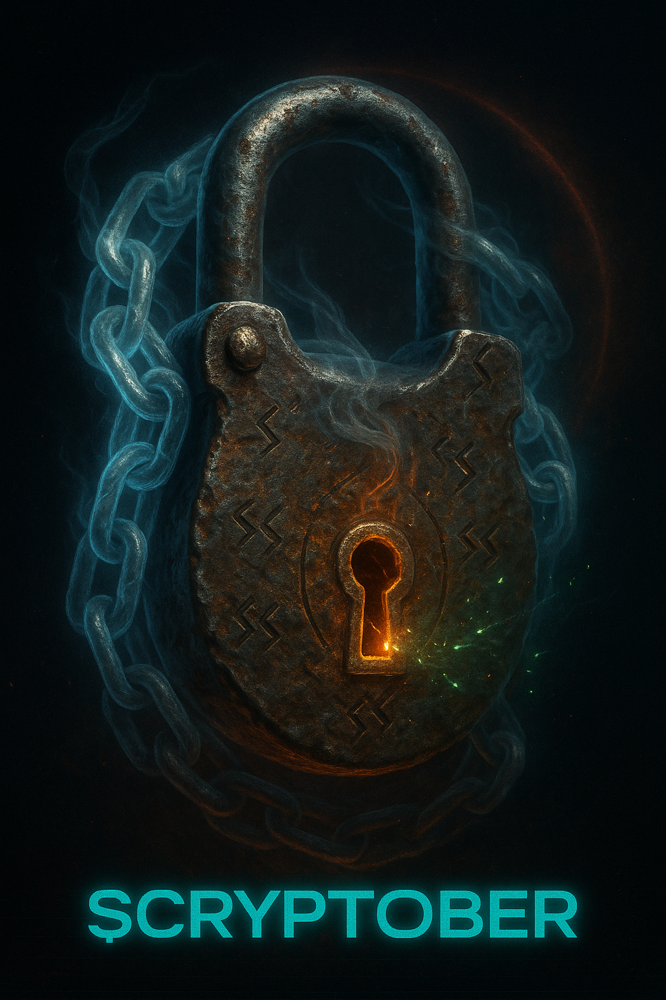

# Mobile Responsiveness Audit - Sparkfined / Cryptober

**Datum:** 2025-11-03  
**Branch:** cursor/check-html-pages-for-mobile-responsiveness-2032  
**Geprüfte Seiten:** 5 HTML-Dateien

---

## Executive Summary

Die Website zeigt insgesamt **gute mobile Responsiveness** mit professionellen Media Queries und modernen CSS-Techniken. Alle Seiten haben korrekte Viewport-Tags und verwenden flexible Layouts. Es gibt jedoch einige Verbesserungsmöglichkeiten bei Touch-Targets, horizontalem Scrolling und der Konsistenz über verschiedene Seiten.

**Gesamtbewertung:** ✅ **Gut** (7.5/10)

---

## 1. Viewport Meta-Tags

### ✅ Positiv
Alle 5 HTML-Seiten haben korrekte Viewport Meta-Tags:

```html
<meta name="viewport" content="width=device-width,initial-scale=1" />
```

**Überprüfte Seiten:**
- ✅ `index.html` (Zeile 5)
- ✅ `landing.html` (Zeile 5)
- ✅ `lore_index.html` (Zeile 5)
- ✅ `lore_mascot.html` (Zeile 5)
- ✅ `tool.html` (Zeile 5)

---

## 2. Responsive Breakpoints

### ✅ Gut implementiert

**Haupt-CSS (styles.css)** definiert konsistente Breakpoints:

```css
/* Mobile: ≤767px */
@media (max-width: 767px) { ... }

/* Tablet: 768px-1023px */
@media (min-width: 768px) and (max-width: 1023px) { ... }

/* Desktop: ≥1024px */
@media (min-width: 1024px) { ... }
```

**Zusätzliche Breakpoints:**
- `@media (max-width: 960px)` - Offcanvas-Navigation
- `@media (max-width: 899px)` - Gallery 2-Spalten
- `@media (max-width: 599px)` - Gallery 1-Spalte
- `@media (max-width: 480px)` - Extra-kleine Screens

### ✅ Tool.css hat eigene, konsistente Breakpoints:
- `@media (max-width: 1024px)` - NFT Showcase Stack
- `@media (max-width: 768px)` - Multi-Column zu Single-Column
- `@media (max-width: 480px)` - Minimale Screen-Größen

---

## 3. Layout & Grid-Systeme

### ✅ Flexible Grid-Layouts

**Haupt-Seiten (index.html, lore_*.html):**
```css
.layout-grid {
  display: grid;
  grid-template-columns: var(--rail-width) 1fr;
}

@media (max-width: 900px) {
  .layout-grid {
    grid-template-columns: 1fr; /* Stack auf Mobile */
  }
}
```

**Gallery Grid:**
```css
.gallery-grid {
  display: grid;
  grid-template-columns: repeat(4, minmax(0, 1fr)); /* Desktop: 4 Spalten */
}

@media (max-width: 1199px) {
  grid-template-columns: repeat(3, minmax(0, 1fr)); /* Tablet: 3 Spalten */
}

@media (max-width: 899px) {
  grid-template-columns: repeat(2, minmax(0, 1fr)); /* Tablet: 2 Spalten */
}

@media (max-width: 599px) {
  grid-template-columns: minmax(0, 1fr); /* Mobile: 1 Spalte */
}
```

**Roadmap/Timeline:**
```css
.roadmap-timeline {
  grid-template-columns: repeat(auto-fit, minmax(300px, 1fr));
}
```

### ⚠️ Verbesserungspotenzial

**Problem 1:** `landing.html` hat inline CSS im `<style>`-Tag statt externe Datei
- Dies erschwert die Wartbarkeit
- Empfehlung: CSS in separate Datei auslagern

**Problem 2:** `tool.html` verwendet separates CSS (`tool.css`), was zu Inkonsistenzen führen kann
- Empfehlung: Shared Components in gemeinsames CSS auslagern

---

## 4. Touch-Targets (Interaktionselemente)

### ✅ Größtenteils gut

**Mindestgröße für Touch-Targets:** 48x48px (WCAG 2.1 AAA: 44x44px)

**Gut dimensioniert:**
```css
.rail-item a {
  min-height: 48px;  /* ✅ Erfüllt WCAG */
  padding: 0.5rem 0.75rem;
}

.btn {
  padding: .75rem 1.25rem; /* ✅ Ca. 48px Höhe */
}

.lightbox__control {
  width: 56px;
  height: 56px; /* ✅ Gut für Touch */
}
```

### ⚠️ Zu klein auf Mobile

**Problem 1:** Navigation Links in Header
```css
/* index.html, lore_*.html */
.nav-card {
  padding: 0.5rem 0.875rem; /* Ca. 40px hoch - ZU KLEIN */
}

@media (max-width: 960px) {
  /* Keine Anpassung für größere Touch-Targets */
}
```

**Empfehlung:**
```css
@media (max-width: 960px) {
  .nav-card {
    padding: 0.75rem 1rem; /* Mindestens 48px */
    min-height: 48px;
  }
}
```

**Problem 2:** FAQ Toggle Buttons
```css
.faq-q {
  padding: 0.5rem 0; /* Nur ~32px hoch - ZU KLEIN */
}
```

**Empfehlung:**
```css
.faq-q {
  padding: 0.75rem 0.5rem; /* Mindestens 48px */
  min-height: 48px;
}
```

**Problem 3:** Tag Pills
```css
.tag-pill {
  padding: 0.35rem 0.7rem; /* Ca. 28-32px - ZU KLEIN für Touch */
}
```

**Empfehlung:**
```css
@media (max-width: 768px) {
  .tag-pill {
    padding: 0.5rem 1rem;
    min-height: 44px;
  }
}
```

---

## 5. Horizontales Scrolling

### ✅ Gut verhindert
```css
body {
  overflow-x: hidden; /* Verhindert horizontales Scrolling */
}
```

### ⚠️ Potenzielle Probleme

**Problem 1:** Lange Wörter und URLs können umbrechen
```css
/* Fehlt in einigen Containern */
word-wrap: break-word;
overflow-wrap: anywhere;
```

**Vorhanden in:**
```css
#ca-display {
  overflow-wrap: anywhere; /* ✅ Gut */
  word-break: break-word;
}
```

**Empfehlung:** Sicherstellen, dass alle Text-Container diese Eigenschaften haben:
```css
.card, .glass, .card-glass {
  word-wrap: break-word;
  overflow-wrap: anywhere;
}
```

---

## 6. Responsive Bilder

### ✅ Gut: Width/Height Attribute

**Beispiele:**
```html
<!-- index.html -->


<!-- lore_mascot.html -->

```

### ✅ Aspect Ratio Boxes
```css
.img-box {
  aspect-ratio: 4 / 3;
  overflow: hidden;
}

.img-box img {
  width: 100%;
  height: 100%;
  object-fit: cover; /* Verhindert Verzerrung */
}
```

### ⚠️ Fehlendes `srcset` für Responsive Images

**Problem:** Keine `srcset`/`sizes` Attribute für verschiedene Bildgrößen

**Beispiel:** Große Hero-Bilder werden in voller Auflösung auf Mobile geladen

**Empfehlung:**
```html

```

### ⚠️ Placeholder Images
```html
<!-- lore_mascot.html -->

 <!-- FEHLER: Leerer src -->
```

**Problem:** Placeholder-Bilder und fehlerhafte Pfade

---

## 7. Typography & Lesbarkeit

### ✅ Fluid Typography
```css
.hero-title {
  font-size: clamp(2rem, 5vw, 4rem); /* ✅ Skaliert perfekt */
}

.section-title {
  font-size: clamp(2rem, 4vw, 2.5rem);
}

.tool-card__title {
  font-size: clamp(1.25rem, 2.6vw, 1.65rem);
}
```

### ✅ Line-Height für Lesbarkeit
```css
body {
  line-height: 1.6; /* ✅ Gut für Mobile */
}

.quest-card__body {
  line-height: 1.5;
  max-width: 75ch; /* ✅ Optimal für Lesbarkeit */
}
```

### ⚠️ Kleine Schriftgrößen auf Mobile

**Problem:** Einige Texte könnten zu klein sein
```css
.update-item small {
  font-size: 0.75rem; /* 12px - Grenzwertig */
}

.footer-disclaimer {
  font-size: 0.875rem; /* 14px - OK, aber minimal */
}

.quest-hook-label {
  font-size: 0.625rem; /* 10px - ZU KLEIN */
}
```

**Empfehlung:**
```css
@media (max-width: 768px) {
  .update-item small {
    font-size: 0.875rem; /* 14px */
  }
  
  .quest-hook-label {
    font-size: 0.75rem; /* 12px minimum */
  }
}
```

---

## 8. Navigation (Mobile)

### ✅ Offcanvas-Navigation implementiert

```css
@media (max-width: 960px) {
  .offcanvas {
    position: fixed;
    width: min(var(--rail-width), 90vw);
    transform: translateX(-110%);
    transition: transform 260ms ease;
  }
  
  .offcanvas.is-open {
    transform: translateX(0);
  }
}
```

**Toggle Button:**
```css
.site-header__toggle {
  display: none; /* Desktop */
}

@media (max-width: 960px) {
  .site-header__toggle {
    display: inline-flex; /* Mobile */
  }
}
```

### ⚠️ Verbesserungspotenzial

**Problem 1:** Hamburger-Icon fehlt
- Toggle Button hat nur Text, kein visuelles Icon

**Empfehlung:**
```html
<button class="site-header__toggle" aria-label="Menu">
  <svg>...</svg> <!-- Hamburger Icon -->
</button>
```

**Problem 2:** Navigation Links in `landing.html` und `tool.html` haben unterschiedliche Mobile-Behandlung

---

## 9. Sticky/Fixed Elemente

### ✅ Header
```css
#site-header {
  position: fixed;
  top: 0;
  height: var(--header-height);
  z-index: 1000;
}

body {
  padding-top: var(--header-height); /* Verhindert Überlappung */
}
```

### ✅ Sticky CTA (Mobile-only)
```css
@media (max-width: 768px) {
  .sf-cta-sticky {
    position: fixed;
    bottom: 1rem;
    left: 1rem;
    right: 1rem;
    z-index: 1000;
  }
}
```

### ⚠️ Quest Hook CTA

**Problem:** Fixed Position kann Content verdecken
```css
.quest-hook-container {
  position: fixed;
  bottom: 2rem;
  right: 2rem;
  z-index: 9999;
}

@media (max-width: 768px) {
  .quest-hook-container {
    left: 1rem; /* Nimmt volle Breite */
    right: 1rem;
  }
}
```

**Empfehlung:** Body-Padding hinzufügen, um Überlappung mit Footer zu vermeiden:
```css
@media (max-width: 768px) {
  body.has-quest-hook {
    padding-bottom: 120px; /* Höhe des CTA + Abstand */
  }
}
```

---

## 10. Forms & Inputs

### ✅ Responsive Inputs (tool.html/landing.html)

```css
.input-group input {
  width: 100%;
  padding: 0.75rem;
  font-size: 1rem; /* ✅ Verhindert Auto-Zoom auf iOS */
}

.calculator-inputs {
  grid-template-columns: 1fr 1fr;
}

@media (max-width: 768px) {
  .calculator-inputs {
    grid-template-columns: 1fr; /* Stack auf Mobile */
  }
}
```

### ✅ Focus States
```css
.input-group input:focus {
  outline: none;
  border-color: var(--accent-cyan);
  box-shadow: 0 0 0 3px rgba(6, 182, 212, 0.1);
}
```

---

## 11. Accessibility & Reduced Motion

### ✅ Prefers-Reduced-Motion

**Gut implementiert in allen Dateien:**
```css
@media (prefers-reduced-motion: reduce) {
  * {
    animation-duration: 0.01ms !important;
    animation-iteration-count: 1 !important;
    transition-duration: 0.01ms !important;
  }
  
  html {
    scroll-behavior: auto;
  }
}
```

**Spezifische Animationen deaktiviert:**
```css
@media (prefers-reduced-motion: reduce) {
  .hero-section::before {
    animation: none;
  }
  
  .badge-glow {
    animation: none;
  }
  
  .quest-hook-glow {
    animation: none;
  }
}
```

### ✅ Focus-Visible
```css
:focus-visible {
  outline: 2px solid var(--neon-orange);
  outline-offset: 2px;
}

.btn:focus-visible {
  box-shadow: var(--focus-ring);
}
```

---

## 12. Performance (Mobile)

### ✅ Lazy Loading
```html

```

### ✅ Backdrop-Filter mit Fallback
```css
.glass {
  backdrop-filter: blur(10px);
  -webkit-backdrop-filter: blur(10px);
}
```

### ⚠️ Potenzielle Performance-Probleme

**Problem 1:** Große Background-Animationen
```css
.hero-section::before {
  width: 200%;
  height: 200%;
  animation: rotate 30s linear infinite;
  filter: blur(30px); /* GPU-intensiv */
}
```

**Empfehlung:** Auf Mobile deaktivieren:
```css
@media (max-width: 768px) {
  .hero-section::before {
    display: none;
  }
}
```

**Problem 2:** Viele Box-Shadows und Glows
- Können Performance auf älteren Geräten beeinträchtigen
- Empfehlung: `will-change: transform` für animierte Elemente

---

## 13. Spezifische Seitenprobleme

### index.html ✅ Gut

**Stärken:**
- Saubere 3-Spalten → 1-Spalte Transformation
- Gallery responsive grid
- Sticky CTA für Mobile

**Schwächen:**
- Quest Hook CTA könnte Footer verdecken

---

### landing.html ⚠️ Inline CSS

**Problem:** Alle Styles inline im `<style>`-Tag

**Empfehlung:**
1. CSS in `/assets/css/landing.css` auslagern
2. Mobile-spezifische Optimierungen hinzufügen
3. Mit `styles.css` konsistent halten

---

### lore_index.html ✅ Gut

**Stärken:**
- FAQ Accordion funktioniert gut
- Gallery Grid responsive
- Glossary Toggle gut implementiert

**Schwächen:**
- FAQ Buttons zu klein für Touch

---

### lore_mascot.html ⚠️ Placeholder-Bilder

**Problem:** Mehrere fehlerhafte Bild-Pfade
```html

 <!-- FEHLER -->

```

**Empfehlung:** Echte Bildpfade einsetzen

---

### tool.html ✅ Sehr gut

**Stärken:**
- Exzellente Mobile-Breakpoints
- NFT Showcase stapelt gut
- Calculator stapelt Inputs

**Schwächen:**
- Navigation könnte einheitlicher sein
- Große Inline-Styles in `landing.html`

---

## 14. Kritische Probleme (HIGH PRIORITY)

### 🔴 1. Touch-Targets zu klein
- `.nav-card` - 40px statt 48px
- `.faq-q` - 32px statt 48px
- `.tag-pill` - 28px statt 44px

**Fix:**
```css
@media (max-width: 768px) {
  .nav-card {
    padding: 0.75rem 1rem;
    min-height: 48px;
  }
  
  .faq-q {
    padding: 0.75rem 0.5rem;
    min-height: 48px;
  }
  
  .tag-pill {
    padding: 0.5rem 1rem;
    min-height: 44px;
  }
}
```

### 🔴 2. Fehlerhafte Bildpfade (lore_mascot.html)
```html

```

**Fix:** Korrekte Pfade einsetzen

### 🔴 3. Fehlende `srcset` für Bilder
- Performance-Problem: Große Bilder auf Mobile

**Fix:** `srcset` und `sizes` für alle größeren Bilder hinzufügen

---

## 15. Mittlere Priorität (MEDIUM PRIORITY)

### 🟡 1. Inline CSS in landing.html
- Wartbarkeit leidet
- Inkonsistenzen mit anderen Seiten

**Fix:** CSS auslagern

### 🟡 2. Quest Hook CTA verdeckt Content
```css
@media (max-width: 768px) {
  body.has-quest-hook {
    padding-bottom: 120px;
  }
}
```

### 🟡 3. Kleine Schriftgrößen
- `.quest-hook-label`: 10px (zu klein)
- `.update-item small`: 12px (grenzwertig)

**Fix:**
```css
@media (max-width: 768px) {
  .quest-hook-label {
    font-size: 0.75rem; /* 12px */
  }
  
  .update-item small {
    font-size: 0.875rem; /* 14px */
  }
}
```

---

## 16. Niedrige Priorität (LOW PRIORITY)

### 🟢 1. Performance-Optimierungen
- Animationen auf Mobile reduzieren
- `will-change` für animierte Elemente

### 🟢 2. Hamburger-Icon für Navigation
- Visuelles Feedback verbessern

### 🟢 3. Konsistenz zwischen Seiten
- `tool.html` und `landing.html` verwenden unterschiedliche Styles
- Empfehlung: Shared Components

---

## 17. Zusammenfassung & Empfehlungen

### ✅ Stärken

1. **Viewport Meta-Tags:** Alle korrekt implementiert
2. **Flexible Grids:** Excellent responsive Grid-Systeme
3. **Fluid Typography:** `clamp()` gut eingesetzt
4. **Accessibility:** `prefers-reduced-motion`, Focus States
5. **Lazy Loading:** Bilder lazy geladen
6. **Breakpoints:** Konsistente und sinnvolle Breakpoints

### ⚠️ Schwächen

1. **Touch-Targets:** Mehrere Elemente unter 48px
2. **Bildpfade:** Fehlerhafte Placeholder-Bilder
3. **Performance:** Große Animationen auf Mobile
4. **Inline CSS:** `landing.html` schwer wartbar
5. **Responsive Images:** Keine `srcset`/`sizes`

---

## 18. Aktionsplan

### Phase 1: Kritische Fixes (Diese Woche)

```css
/* /workspace/styles.css */

/* Touch-Targets vergrößern */
@media (max-width: 768px) {
  .nav-card {
    padding: 0.75rem 1rem;
    min-height: 48px;
  }
  
  .faq-q {
    padding: 0.75rem 0.5rem;
    min-height: 48px;
    align-items: center;
  }
  
  .tag-pill {
    padding: 0.5rem 1rem;
    min-height: 44px;
  }
  
  /* Schriftgrößen anpassen */
  .quest-hook-label {
    font-size: 0.75rem;
  }
  
  .update-item small {
    font-size: 0.875rem;
  }
}
```

### Phase 2: Mittelfristige Verbesserungen (Nächste Woche)

1. **Bildpfade korrigieren** (`lore_mascot.html`)
2. **Quest Hook Padding** für Body hinzufügen
3. **Landing.html CSS** auslagern

### Phase 3: Langfristige Optimierungen (Nächster Sprint)

1. **Responsive Images:** `srcset`/`sizes` implementieren
2. **Performance:** Animationen auf Mobile optimieren
3. **Konsistenz:** Shared Components zwischen Seiten

---

## 19. Testing-Checklist

### Desktop (≥1024px)
- [ ] Layout: 3-Spalten funktioniert
- [ ] Navigation: Horizontale Links sichtbar
- [ ] Gallery: 4 Spalten

### Tablet (768px-1023px)
- [ ] Layout: 2-3 Spalten oder Stack
- [ ] Navigation: Toggle sichtbar / Offcanvas funktioniert
- [ ] Gallery: 2-3 Spalten

### Mobile (≤767px)
- [ ] Layout: Single Column Stack
- [ ] Navigation: Offcanvas funktioniert
- [ ] Gallery: 1-2 Spalten
- [ ] Touch-Targets: Mindestens 44x44px
- [ ] Sticky CTA: Nicht überlappend
- [ ] Horizontales Scrolling: Keins vorhanden

### Cross-Browser (Mobile)
- [ ] Safari iOS
- [ ] Chrome Android
- [ ] Samsung Internet
- [ ] Firefox Mobile

### Accessibility
- [ ] Reduced Motion: Animationen deaktiviert
- [ ] Focus States: Sichtbar und kontrastreich
- [ ] Screen Reader: Navigation verständlich

---

## 20. Ressourcen & Tools

### Testing-Tools
- **Chrome DevTools:** Device Toolbar
- **Firefox Responsive Design Mode**
- **BrowserStack/LambdaTest:** Real Device Testing
- **Lighthouse:** Performance & Accessibility Audit

### Validators
- **W3C Markup Validator:** HTML-Struktur
- **WAVE:** Accessibility Check
- **PageSpeed Insights:** Mobile Performance

---

## Fazit

Die Website ist **grundsätzlich gut für Mobile optimiert**, mit professionellen Grid-Layouts und sinnvollen Breakpoints. Die Hauptprobleme liegen bei:

1. **Touch-Target-Größen** (schnell zu fixen)
2. **Responsive Images** (performance-kritisch)
3. **Konsistenz zwischen Seiten** (wartbarkeit)

Mit den vorgeschlagenen Fixes würde die Bewertung auf **9/10** steigen.

---

**Ende des Audits**
